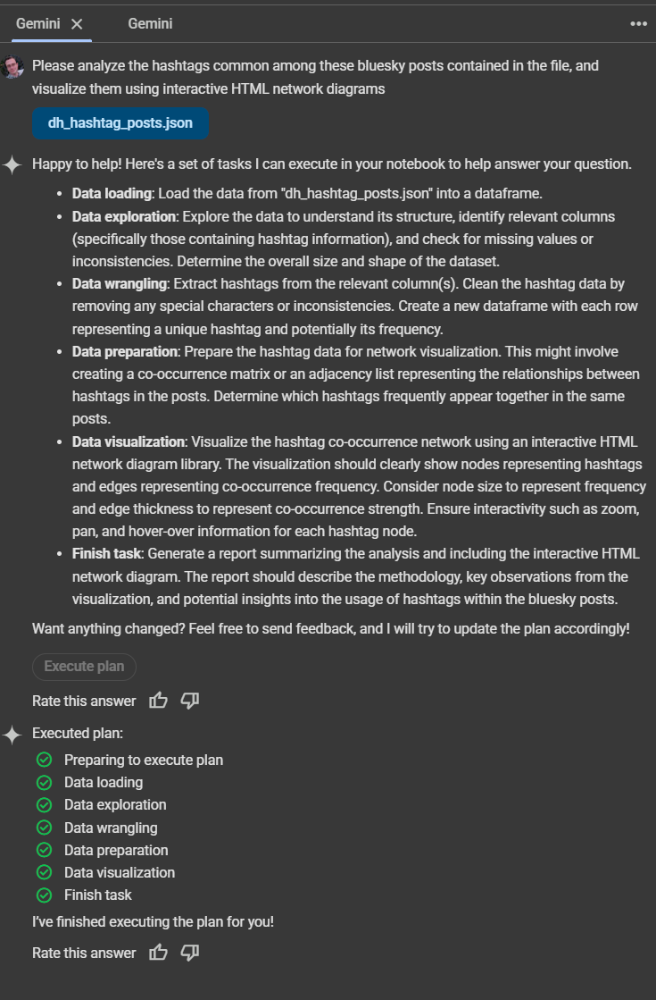

# AI-Powered Social Network Analysis Workshop Part 2
*Using LLMs to Visualize Bluesky Social Networks*

The second part will have you create a visualization first by hand (using a notebook and prompts as a guide) then fully autonomously using Gemini.

## Workshop Slides

<iframe src="bluesky/bluesky_slides.html" width="800" height="500" frameborder="0" allowfullscreen></iframe>

**Note:** If the embedded slides don't display properly, [view them directly here](bluesky/bluesky_slides.html).

These slides cover key concepts of AI-assisted social media analysis, including:
- Multi-AI strategies for research
- AI-powered troubleshooting techniques
- Converting analysis into meaningful insights
- Building a sustainable research practice

## Network Visualization

<iframe src="bluesky/hashtag_network.html" width="800" height="500" frameborder="0" allowfullscreen></iframe>

**Note:** If the embedded visualization doesn't display properly, [view it directly here](bluesky/hashtag_network.html).

This visualization shows the network connections between hashtags in the analyzed Bluesky posts, revealing patterns in how topics are related and clustered in the social media discourse.


# Access the HuggingFace Dataset
## Step 1: Navigate to the dataset page

Go to: https://huggingface.co/datasets/withalim/bluesky-posts
You'll see a dataset with ~7.8 million Bluesky posts

## Step 2: Get your HuggingFace token

Click on your profile icon (top right)
Go to "Settings" → "Access Tokens"
Click "New token"
Name it something like "bluesky-workshop"
Select "Read" permissions
Copy the token (starts with hf_...)

## Step 3: Set Up Google Colab
Copy your token over to Google Colab, naming the secret as "HF_TOKEN" and then pasting it in. You must also enable that token for this notebook.


Create a new jupyter notebook, or use the starter notebook:

- [Bluesky completed](Bluesky_Visualization.ipynb)

--- 

## Part 1: Understanding Social Networks Through AI

### 1.1 Core Concepts

**What is a Social Network?**
A social network is a mathematical representation of relationships between entities. In our case:
- **Nodes** = People or concepts (users, hashtags)
- **Edges** = Relationships (mentions, co-occurrences)
- **Weights** = Strength of relationships (frequency of interaction)

**Two Network Types We'll Build:**
1. **Mention Networks**: Who talks to whom? Reveals influence patterns and communities
2. **Hashtag Networks**: Which topics cluster together? Shows thematic relationships

### 1.2 Using AI to Understand Your Data

**Prompt Example for Claude/ChatGPT:**
```
I have a dataset of social media posts. Help me understand:
1. What makes a good research question for network analysis?
2. How do I decide between analyzing mentions vs hashtags?
3. What patterns should I look for in my visualization?
```

**Key Questions AI Can Help You Explore:**
- What does centrality mean in social networks?
- How do I interpret clustering in my network?
- What do isolated nodes tell me about my community?
- How do I identify influential users or trending topics?

---

## Part 2: Data Strategy and Best Practices

### 2.1 The Iterative Data Workflow

**Phase 1: Explore and Sample**
- Start small (100-1000 posts) to understand your data structure
- Use AI to help interpret initial patterns
- Refine your research questions based on early findings

**Phase 2: Scale and Refine**
- Increase dataset size gradually
- A/B test different filtering approaches
- Use AI to suggest alternative analytical approaches

**Phase 3: Validate and Document**
- Cross-reference findings with multiple visualizations
- Have AI help explain your results in plain language
- Document your methodology for reproducibility

### 2.2 Smart Data Management

**File Naming Convention (AI-Suggested):**
```
bluesky_ai_posts_raw.jsonl           # Original filtered data
bluesky_ai_mentions_processed.json   # Processed mention network
bluesky_ai_hashtags_v2.json         # Hashtag network (version 2)
bluesky_ai_analysis_notes.md        # Your findings and insights
```

**Ask AI to Help You Structure Your Data:**
```
Prompt: "I'm analyzing social media data. Help me design a folder structure 
and naming convention that will help me track different experiments, 
versions, and findings over time."
```

**Version Control Your Analysis:**
- Save each iteration of your filtered dataset
- Document what changes you made and why
- Use AI to help you write clear commit messages or change logs

### 2.3 Collaborative Analysis with AI

**Before Each Analysis Step, Ask:**
- "What am I trying to learn from this network?"
- "What patterns would be meaningful vs. just noise?"
- "How do I know if my results are statistically meaningful?"

**AI Prompt Templates:**
```
Analysis Planning:
"I want to study [TOPIC] on Bluesky. Help me design a research approach 
that examines [SPECIFIC ASPECT]. What data should I collect and how 
should I filter it?"

Pattern Recognition:
"I see [DESCRIBE PATTERN] in my network visualization. Help me interpret 
what this might mean and suggest follow-up analyses."

Method Validation:
"I used [METHOD] to analyze [DATA]. What are the limitations of this 
approach and how could I validate my findings?"
```

---

## Part 3: Setting Up Your AI-Assisted Workflow

### 3.1 Environment Setup with AI Guidance

Instead of memorizing installation commands, ask your AI assistant:

```
Prompt: "I want to analyze social media networks in Google Colab. 
Walk me through setting up my environment, and explain what each 
library does and why I need it."
```

**Key Libraries You'll Learn About:**
- `datasets`: Accessing HuggingFace data repositories
- `re`: Pattern matching for extracting mentions and hashtags
- `json`: Handling structured data storage and retrieval
- `collections`: Efficient counting and grouping operations

### 3.2 Understanding Data Access

**Conceptual Question for AI:**
```
"Explain the HuggingFace dataset ecosystem. How do tokens work, 
what are the ethical considerations, and how do I responsibly 
access large social media datasets?"
```

**What You're Really Learning:**
- How to authenticate with data APIs
- Understanding dataset licensing and usage rights
- Best practices for handling personal data in research

---

## Part 4: AI-Driven Network Analysis

### 4.1 Mention Networks: Understanding Social Influence

**Concept First, Code Second**

**Ask AI to Explain:**
```
"What does a mention network reveal about online communities? 
What patterns indicate influence, engagement, or community structure?"
```

**Key Concepts to Understand:**
- **Degree Centrality**: Who has the most connections?
- **Betweenness Centrality**: Who bridges different groups?
- **Clustering Coefficient**: How tightly knit are subgroups?
- **Network Density**: How connected is the overall community?

**Iterative Refinement with AI:**
1. Build your first network
2. Ask AI: "What do you notice in this visualization?"
3. Refine based on suggestions
4. Ask: "How can I make this more informative?"
5. Repeat until insights emerge

### 4.2 Hashtag Networks: Mapping Topic Relationships

**Conceptual Foundation**

**AI Discussion Starter:**
```
"I want to understand how topics relate to each other in social media. 
Explain hashtag co-occurrence analysis and what patterns I should 
look for in the results."
```

**What You're Learning:**
- **Semantic Clustering**: Topics that appear together frequently
- **Bridge Topics**: Hashtags that connect different communities
- **Temporal Patterns**: How topic relationships change over time
- **Linguistic Analysis**: What word associations reveal about culture

### 4.3 Working with AI on Visualizations

**The Conversation-Driven Approach:**

1. **Describe Your Goal**: "I want to show how AI researchers connect on Bluesky"
2. **Get AI Suggestions**: "What visualization approach would work best?"
3. **Iterate on Design**: "This looks cluttered - how can I improve it?"
4. **Refine Analysis**: "What does this pattern suggest about the community?"

**Sample AI Conversation:**
```
You: "My network has too many isolated nodes. What does this mean?"

AI: "Isolated nodes in mention networks often indicate:
- Lurkers who post but don't engage
- New users not yet integrated
- Bots or promotional accounts
- Niche topics with limited crossover

Try filtering by minimum activity level or connection strength."

You: "How do I decide what threshold to use?"

AI: "Let's analyze this systematically..."
```

---

## Part 5: Iterative Visualization with AI

### 5.1 The Design Thinking Process

**Phase 1: Rapid Prototyping**
- Create quick, basic visualizations
- Focus on data structure, not aesthetics
- Use AI to identify what's working and what isn't

**Phase 2: Pattern Recognition**
- Ask AI to help interpret initial visualizations
- Generate hypotheses about what patterns mean
- Design focused follow-up analyses

**Phase 3: Refinement and Storytelling**
- Use AI to help craft clear narratives from your data
- Iterate on visual design for clarity
- Validate findings through multiple analytical approaches

### 5.2 AI-Assisted Troubleshooting

**Common Issues and AI Solutions:**

**Problem**: "My visualization is too crowded"
**AI Prompt**: "Help me reduce visual complexity while preserving important patterns"

**Problem**: "I don't understand what I'm seeing"
**AI Prompt**: "Explain this network pattern and suggest what questions I should ask"

**Problem**: "My results seem biased"
**AI Prompt**: "Help me identify potential biases in my data selection and analysis methods"

### 5.3 Documentation and Reproducibility

**AI as Your Documentation Partner:**

```
Prompt: "Help me document this analysis so someone else could 
reproduce my work. What information is essential to include?"
```

**What Good Documentation Includes:**
- Clear research questions and hypotheses
- Data collection and filtering decisions
- Parameter choices and their rationale
- Interpretation of results and limitations
- Next steps and future research directions

---

## Part 6: Advanced Analysis with AI

### 6.1 Comparative Analysis

**AI-Guided Questions:**
- "How does the AI community network compare to other tech topics?"
- "What changes over time in network structure?"
- "How do different platforms' networks differ?"

### 6.2 Statistical Validation

**Working with AI on Statistics:**
```
Prompt: "I found [PATTERN] in my network. Help me determine if this 
is statistically significant and what tests I should run to validate it."
```

### 7.1 AI Tools Comparison

**Claude**: Excellent for technical explanations and code review
**ChatGPT**: Great for brainstorming and creative problem-solving  
**Gemini**: Strong at data interpretation and pattern recognition

**Multi-AI Strategy**: Use different AIs for different perspectives on the same problem.

### 7.2 Building Your AI Prompt Library

**Create Reusable Prompts:**
- Data interpretation templates
- Visualization troubleshooting guides
- Statistical analysis workflows
- Documentation and presentation helpers

---

## Part 8: From Analysis to Insight

### 8.1 AI-Assisted Interpretation

**Moving Beyond Description:**
```
Prompt: "I found that AI researchers form tight clusters but rarely 
mention mainstream tech accounts. Help me interpret what this means 
for knowledge transfer in the tech community."
```

---

## Best Practices Summary

### Data Management
- **Version everything**: datasets, code, visualizations, insights
- **Document decisions**: why you filtered data, chose parameters, made interpretations
- **Save incrementally**: don't lose hours of work to a single mistake

### AI Collaboration
- **Ask conceptual questions first**: understand the theory before implementation
- **Iterate in conversation**: treat AI as a thinking partner, not a code generator
- **Cross-validate**: use multiple AI tools for important insights
- **Stay critical**: AI can be wrong; validate important findings independently

### Skill Development
- **Focus on concepts**: the specific tools will change, but analytical thinking endures
- **Practice articulation**: the clearer your questions, the better your AI collaborations
- **Build intuition**: develop a sense for what patterns are meaningful vs. coincidental

---

## Troubleshooting with AI

Instead of memorizing error messages, learn to:

1. **Describe symptoms clearly**: "My visualization loads but doesn't show any nodes"
2. **Provide context**: "I'm analyzing 500 posts about AI, filtered by mentions"
3. **Ask for systematic debugging**: "Walk me through checking each step"
4. **Learn from solutions**: "Explain why this error occurred so I can prevent it"

# Fully Autonomous Gemini File Analysis

You can upload a file collected using the above methods (and HuggingFace) and ask for assistance from Gemini in the dedicated chat.

I recommend prompts that incorporate a description of the dataset (as much detail as is useful), a description of what you want to investigate, and how you want the output (specific graphs, visualizations, etc).

