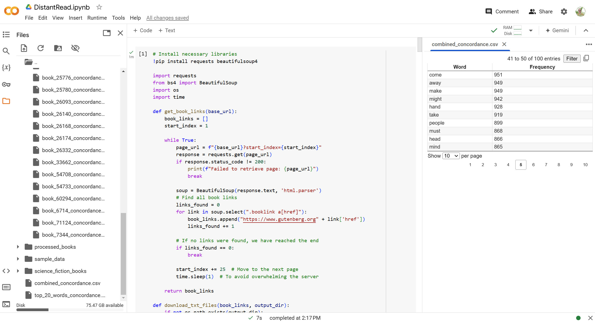

## Exercise: Combinatorial Texts

For our first steps generating and running code in [Google Colab](https://colab.research.google.com/), we'll be taking influences from NaNoGenMo but work smaller to create a procedurally-generated, combinatorial short story. This prompt draws on some of the controversy around NaNoWriMo and, of course, the questions of AI authorship and particularly the questions of who's doing the authoring. For this exercise you'll be generating text, but instead of asking the LLM to produce text itself, you'll be drawing from a number of public domain or creative commons source texts and asking for code to combine them. As with the distant read, I recommend selecting your source texts from Project Gutenberg, but you are welcome to select any set of short stories appropriately licensed for this usage.

Create a new project for this exercise: we'll be working back and forth between generating and testing Python code. Do not ask ChatGPT to execute any of the code: you will be doing that directly, and in doing so you will be able to work at a much larger scale with access to libraries of existing code.

The interface (shown above) is similar to that of Visual Studio Code: files will appear at the side as you work, and you can pull up those files to verify output at every stage. Add one script at a time by selecting **+CODE**, then press **PLAY** to begin.

### Cut and Paste Text

For examples of the type of work we're going to be creating here, consider [reading the overview on the NaNoGenMo repository](https://nanogenmo.github.io/).  I also recommend checking out the NaNoGenMo works featured in the Electronic Literature Collection Volume 4, particularly [Lee Tusman's "Pomelo: A Book of Instructions and Drawings" inspired by Yoko Ono's work](https://collection.eliterature.org/4/pomelo-a-yoko-ono-grapefruit-generator); [Delacannon's "Old School Dungeon Crawler GameBook Generator"](https://collection.eliterature.org/4/oldschool-dungeon-crawler-gamebook-generator); [Nick Montfort's minimalist experiment "consequence"](https://collection.eliterature.org/4/consequence); [Liza Daly's kinetic "A Physical Book"](https://collection.eliterature.org/4/a-physical-book). These are all much more ambitious projects than you'll be taking on this week, but they will give you an idea of what is possible!

Next, source at least five text files to work with for your project. Plain text files will work best. For my examples, I used a set of science fiction short stories found in Project Gutenberg. As before, you'll need to ask it to pre-process the texts: make sure to check the output as you go. 

Once you have at least five cleaned files that you're happy with, start asking ChatGPT to write Python code to transform and/or combine the text(s) using different methods. Take a look through [Zach Whalen's NaNoGenMo Workshop](https://zachwhalen.notion.site/NaNoGenMo-Workshop-b984ee239e9e4cb8a99eb69fda617204) and this week's readings for ideas on how to approach combining your texts - and yes, you can explain the project to ChatGPT and ask it for suggestions as well. Here's a few of the methods you might try, both on individual texts and on re-mixed texts:

- *Find and Replace* - Consider replacing specific words, swapping character names between stories, changing characters from humans to cats (and so on), or using a deterministic method: [Zach Whalen's overview has several examples](https://zachwhalen.notion.site/Find-and-Replace-3eb80d9ef13048469e37a43beb193047).
- *Erasure / Lipogram* - Try to exclude a letter of the alphabet from your texts, and consider the results. You might have to get creative with this or decide to embrace some of the nonsense that will likely remain. You can also eliminate certain words or categories of words.
- *Cento* - A cento is a text composed entirely out of other texts: ask ChatGPT to work across your texts to assist with this type of combinatorial process. For ideas on how to think about this type of constraint, take a look at [Christopher Higgs on the history of the Oulipo and "potential" literature](https://agnionline.bu.edu/essay/the-annoying-lacuna-one-unofficial-history-of-the-oulipo/).
