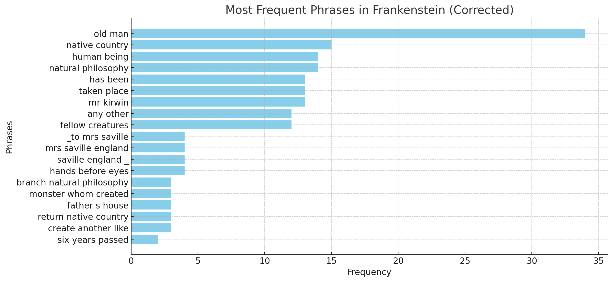
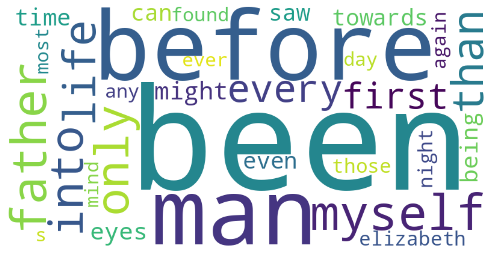
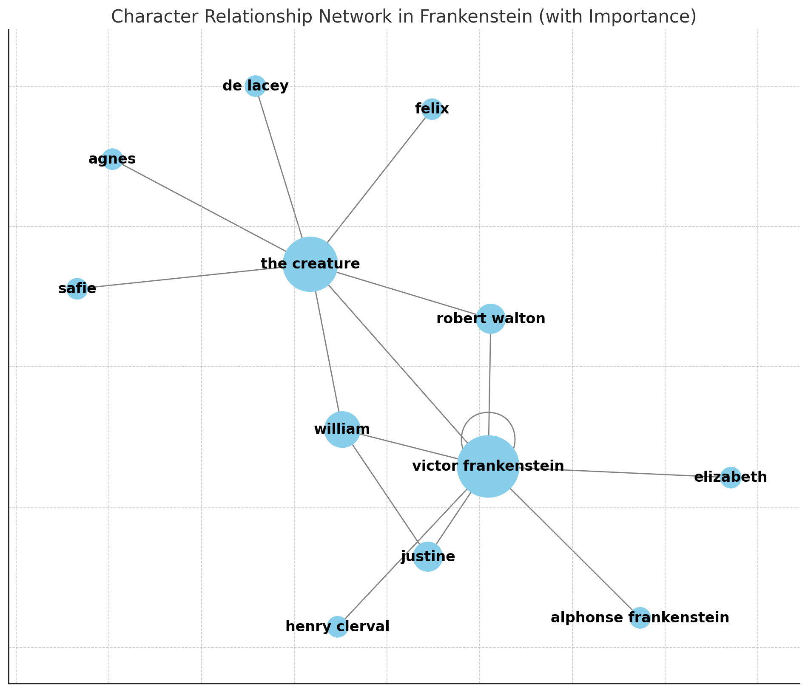
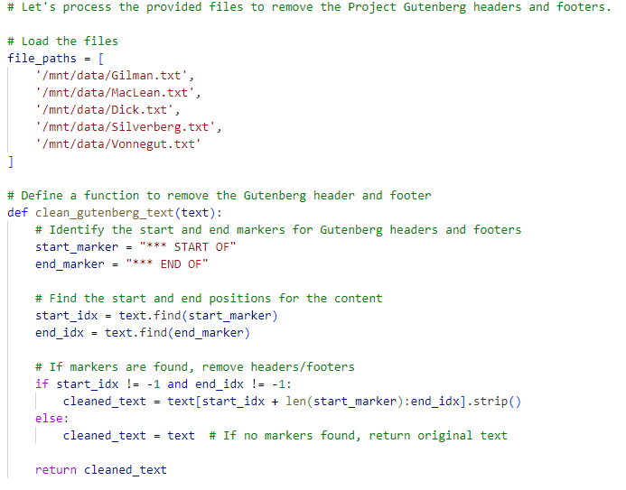

## Exercise: Reading Across Texts

To start to explore the relationship between distant reading and distant coding, we're going to work within a LLM's interface for textual analysis, then move into Python. For this exercise, you're going to choose at least one text to analyze through distant reading, starting with my prompts and working towards developing and iterating your own questions. Depending on the context window of the model you've chosen, you might find that you have trouble getting results with a complete text, particularly one of the longer books: keep iterating until you are happy with your results.

### AI-Assisted Distant Read

Start by selecting a work from [Project Gutenberg](https://www.gutenberg.org/) (anything other than *Frankenstein*, as I'm using that here as a sample), and make sure you download the "Plain Text UTF-8" version as a .txt file. For instance, the plain text version of *Frankenstein* is the file here: [TXT](https://www.gutenberg.org/cache/epub/41445/pg41445.txt). You'll notice that this plain text version has some noise at the top of the file, and at the end – this is information and metadata added by Project Gutenberg. We could delete that ourselves, but we're going to try out the model's preprocessing and have it work with us throughout the entire process. So, download that plain text file for now and have it ready to attach when you're in conversation with the system.

Here's a guiding set of basic prompts to try - these are general, and it might require several iterations to get the output of each:

- I'd like to do some distant reading analysis of a novel. Can you help me through the process?
- I've attached the Project Gutenberg version of our text. Let's start by pre-processing it for analysis.
- Can you provide me the pre-processed text as a file to confirm?
- Can you generate a bag of words for our next steps?
- Many of these are common words, can you apply a basic stopwords to remove things like I, the, do, is, our, etc?
- Can you visualize the top 30 words as a word cloud?
- Using the bag of words and the cleaned text, could you make some determinations about the genre of this work and the themes?
- Can you visualize the network of character relationships in this text?
- Can you pull the most frequently recurring phrases?
- Can you visualize the most frequent phrases?

These basic steps will result in errors, but they can also provide some useful rapid visualizations and data. Here's a few examples from my output - you'll notice that the charts in some cases mention they are corrected because I had to ask for several iterations:

*Figure 1. Frequent bigrams and trigrams*

*Figure 2. Word cloud, after iterating stop words*

*Figure 3. Character network, weighting for significance*

 When working with ChatGPT, select "View Analysis" after you ask for pre-processing. For instance, here's a sample of the Python code that ChatGPT 4.0 generated in response to my request to pre-process Project Gutenberg files and remove the header and footer text:

Try to use the information you see to debug problems by asking ChatGPT for specific changes that might lead to better outcomes: this is a good way to get used to working with Python code at a distance.

